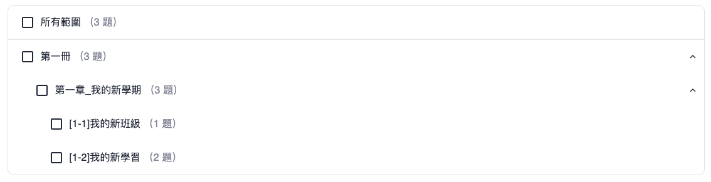

### Mui-Tree-Select

使用 Mui Tree 搭配 checkbox 實現樹狀多選單



#### Props

iconDirection => 調整按鈕位置

collapseIcon => 收合時的icon

expandIco => 展開時的icon

treeData => 樹狀資料

selectNode => 以選擇的節點

setSelectNode => 選取節點的 function (???)

iconReverse => icon 顯示在後方，預設為 false => UIUX怪怪的

checkboxColor => checkbox 顏色，可自定義 => (border 可調整??)

expanded => 可點擊的節點 (使用者自控) => 待補

wrapperBorder => 最外層的 border 樣式


#### treeData 格式

```ts
export type TreeData = {
    name: string,
    id: string,
    parent?: string;
    children?: TreeData[]
}
```

